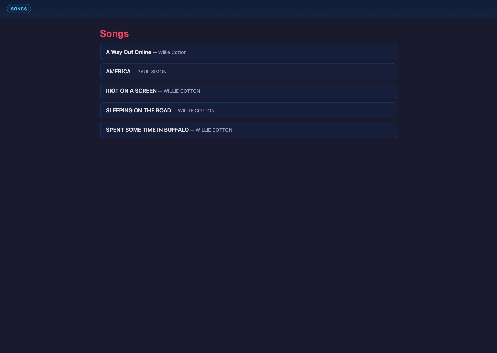
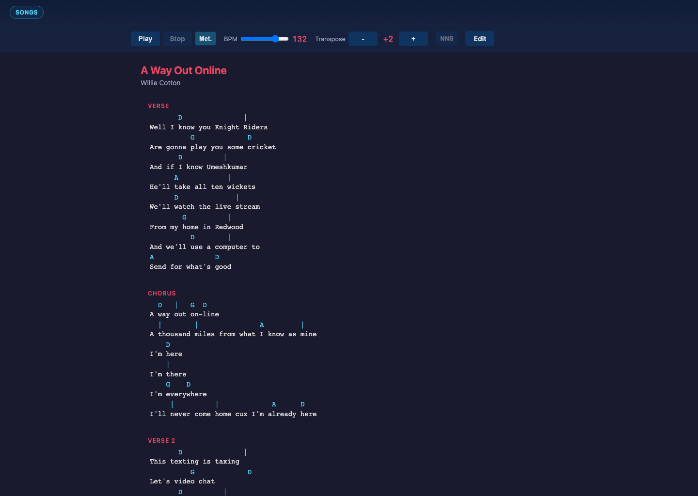
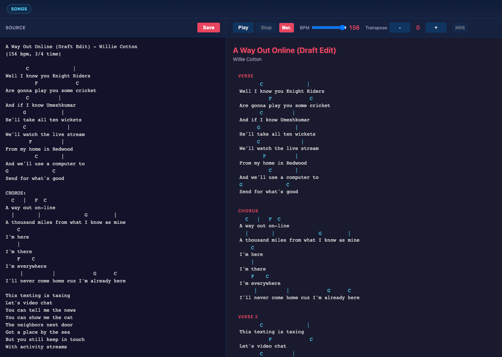
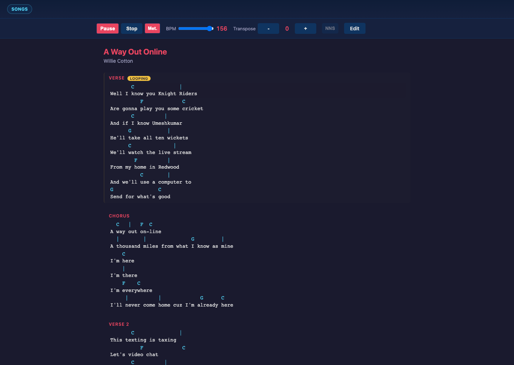
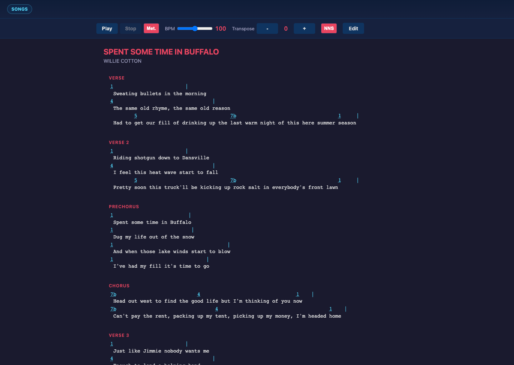

# songsheet-app

`songsheet-app` is a text-first song chart editor and player built with React 19 + TypeScript, Express/Vite SSR, and Tone.js.

It takes plaintext song files, parses them into structured song data, renders chord/lyric charts, and plays them back with synchronized highlighting.

## Start In 30 Seconds

```bash
npm install
npm run dev
```

Then open `http://localhost:3000/songs`.

## Guided Product Tour

This walkthrough tells the app story in the same order most users experience it: find a song, shape playback, edit the text, rehearse loops, switch notation, then look at parsing internals.

### 1) Browse the song library

The song list is the entry point into the system. From this page you pick a chart and move into either the song detail view for playback or the edit view for source updates.



### 2) Shape playback settings from the chart view

On `/songs/:id`, the chart and transport controls are already connected, so you can immediately shape how the song feels. Transpose shifts harmonic output in semitone steps, BPM changes pacing, and the metronome toggle adds or removes the beat click layer. What you should hear is a soft synth progression that follows the chart timeline, with a click on each beat when metronome is on; for `a-way-out-online` this resolves to a fast three-beat pulse because the song is `3/4` at `156 bpm`.



When you want to change the text model itself, use the `Edit` button on this page to transition to `/songs/:id/edit`.

### 3) Edit plaintext and see the chart update live

The edit view keeps source and rendered output side-by-side, so each change stays grounded in visible feedback. As you type, metadata, chord rows, lyric alignment, and section structure are re-parsed in place, and BPM or meter edits become the next playback behavior without any separate conversion step.



### 4) Play the chart and loop a section

Playback advances through parsed positions while highlighting active markers in the chart. Double-clicking a section header enables vamp mode for that section, which is useful for rehearsal and timing checks. In audio terms, you hear the same cadence cycling until vamp is cleared, with the optional metronome click staying locked to the loop.



### 5) Switch chord notation to Nashville numbers

For keyed songs, you can switch to Nashville Number System to see scale-degree harmony instead of letter-name chords. This changes representation, not musical intent, so playback audio remains harmonically equivalent while the chart becomes easier to communicate in number-based workflows.



### 6) Deep dive: parse text into a full song detail page

The primary reference file is `public/songs/a-way-out-online.txt`, which is the source used across the screenshots above.

<details>
<summary>Full source: <code>public/songs/a-way-out-online.txt</code></summary>

```txt
A Way Out Online - Willie Cotton
(156 bpm, 3/4 time)

       C               |
Well I know you Knight Riders
          F             C 
Are gonna play you some cricket
       C          |
And if I know Umeshkumar
      G            |
He'll take all ten wickets
      C              |
We'll watch the live stream
        F          |
From my home in Redwood
          C        |
And we'll use a computer to
G               C
Send for what's good

CHORUS:
  C   |   F  C
A way out on-line
  |        |               G         |
A thousand miles from what I know as mine
    C
I'm here
    |
I'm there
    F    C 
I'm everywhere
     |          |             G      C
I'll never come home cuz I'm already here

This texting is taxing
Let's video chat
You can tell me the news
You can show me the cat
The neighbors next door
Got a place by the sea
But you still keep in touch
With activity streams

CHORUS

Faces from high school
Still staring at me
But now I know more
About what they believe
The girls are all mothers
And they've got different names
The boys necks are fatter
But their eyes look the same

CHORUS

Starcraft, Star Trek
And *.gif
Or downloading 
An 8 megabyte tiff
Like a pirate, a sailor
I sail those seas
Living on limes and tonics
And movies for free
```
</details>

Current parser output summary for that file:

```json
{
  "title": "A Way Out Online",
  "author": "Willie Cotton",
  "bpm": 156,
  "timeSignature": {
    "beats": 3,
    "value": 4
  },
  "key": null,
  "sections": 7,
  "playbackMeasures": 112,
  "firstSection": "verse",
  "firstLine": "Well I know you Knight Riders"
}
```

That parsed structure drives the full rendered detail page and playback timeline:


In this file, syntax and semantics map directly onto behavior: the `Title - Author` header defines metadata, `(156 bpm, 3/4 time)` configures transport defaults, chord placement is column-sensitive against lyric text, `|` encodes measure boundaries, and labels like `CHORUS:` become explicit structural entries that both rendering and playback consume.

## Regenerate README Screenshots

```bash
npm run test:e2e -- e2e/readme-screenshots.spec.ts
```

Artifacts are written to `screenshots/`.

## Development Commands

| Command | Description |
|---------|-------------|
| `npm run dev` | Start Express server with Vite middleware |
| `npm run build` | Build client and SSR server bundles |
| `npm run start` | Run production server |
| `npm run preview` | Alias for production server |
| `npm run typecheck` | Type-check without emitting |
| `npm test` | Run Vitest tests |
| `npm run test:watch` | Vitest in watch mode |
| `npm run test:ui` | Vitest browser UI |
| `npm run test:e2e` | Run Playwright E2E tests |

## Project Map

```text
server.ts                    # Express server (SSR + GraphQL endpoint)
src/
  components/
    pages/
      SongList.tsx           # /songs
      SongDetail.tsx         # /songs/:id
      SongEdit.tsx           # /songs/:id/edit
    SongView.tsx             # Controls + rendering + playback state integration
    SongRendering.tsx        # Chord/lyric rendering
  audioEngine.ts             # Tone.js scheduling and playback callbacks
  useAudioPlayback.ts        # Playback hook and engine lifecycle
  useAutoScroll.ts           # Auto-scroll during playback
  chordUtils.ts              # Chord helpers
  shared/graphql/            # Shared schema/operations
  server/graphql/            # Data store + executors
test/                        # Vitest tests
e2e/                         # Playwright tests + README screenshot scenarios
public/songs/                # Plaintext song files
```
