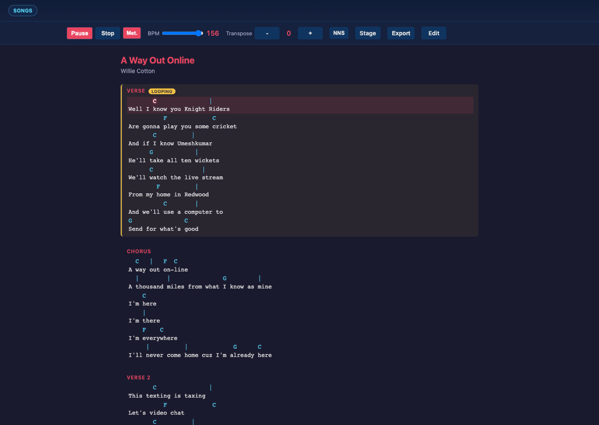
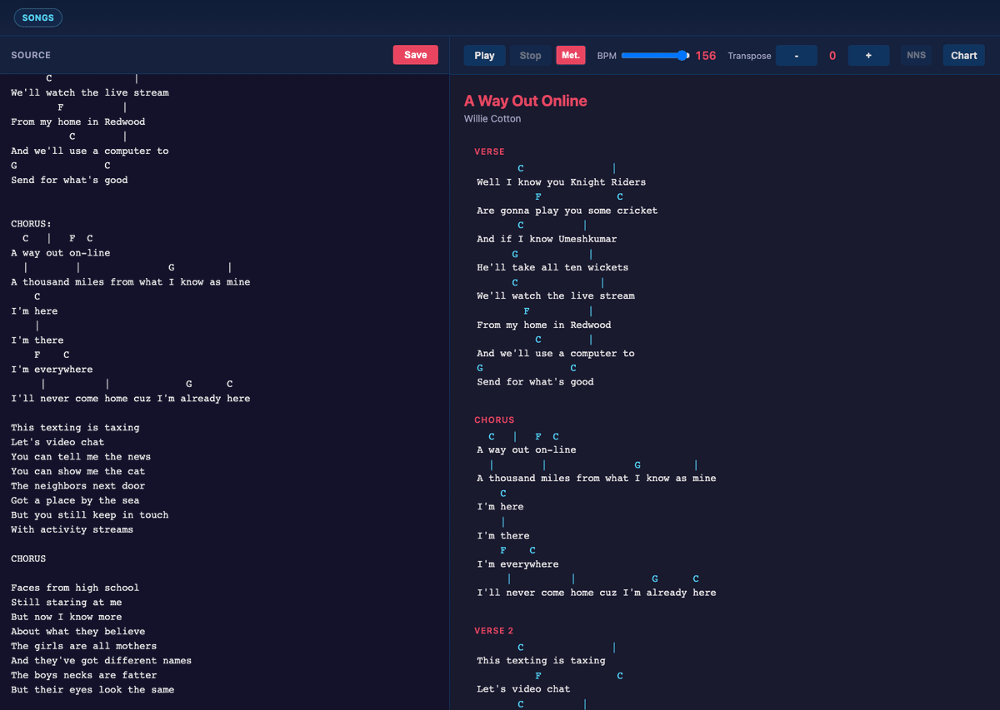
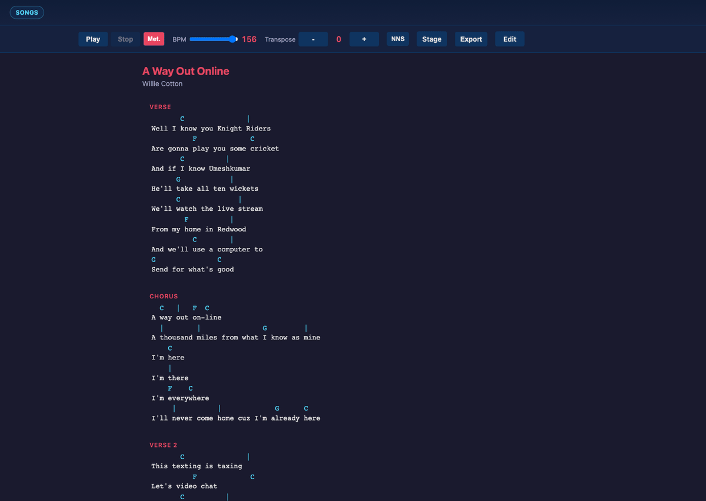
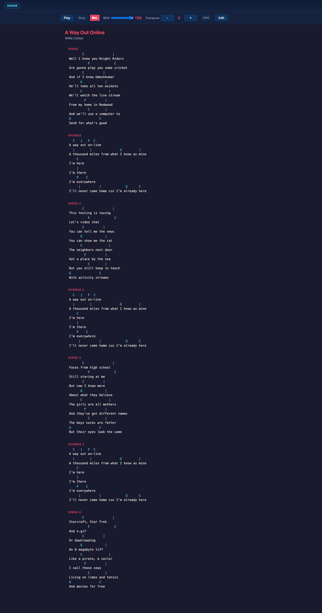

# songsheet-app

songsheet-app is a text-first song chart editor and player built with React 19, TypeScript, Express/Vite SSR, and Tone.js.

It takes plaintext song files, parses them into structured song data, renders chord and lyric charts, and plays them back with synchronized highlighting.

## Start

```bash
npm install
npm run dev
```

Open `http://localhost:3000/songs` and select a chart.

## Playback and Vamping

Playback advances through parsed positions while highlighting the active section and chord marker in the chart. Double-clicking a section header enables vamp mode for that section, cycling the audio cadence while the optional metronome click stays locked to the loop.



## Text-First Live Editing

The edit view keeps the plaintext source and rendered output side-by-side. Metadata, chord rows, lyric alignment, and section structure are re-parsed in place as you type, and edits to the BPM or meter become the next playback behavior immediately without any separate conversion step. The README demo inserts a new `PRECHORUS:` block directly before the first `CHORUS:` marker so you can see section creation happen in real time.



## Chart Features

The chart and transport controls directly manipulate the parsed musical intent. Transpose shifts harmonic output in semitone steps, the Nashville Number System toggle translates keyed songs to scale-degree harmony, the export menu provides output paths like printing or plain text downloads, and the dedicated performance view enlarges typography for stage readability.



## Parsing Plaintext

Syntax and semantics map directly onto behavior. The header defines metadata and default transport settings. Chord placement is column-sensitive against lyric text. Measure boundaries are encoded with vertical pipes, and section labels create explicit structural entries consumed by both the renderer and the audio engine.

### 8) Deep dive: parse text into a full song detail page

The primary reference file is `public/songs/a-way-out-online.txt`, which is the source used across the screenshots above.

<details>
<summary>Full source: <code>public/songs/a-way-out-online.txt</code></summary>

```txt
A Way Out Online - Willie Cotton
(156 bpm, 3/4 time)

       C               |
Well I know you Knight Riders
          F             C 
Are gonna play you some cricket
       C          |
And if I know Umeshkumar
      G            |
He'll take all ten wickets
      C              |
We'll watch the live stream
        F          |
From my home in Redwood
          C        |
And we'll use a computer to
G               C
Send for what's good

CHORUS:
  C   |   F  C
A way out on-line
  |        |               G         |
A thousand miles from what I know as mine
    C
I'm here
    |
I'm there
    F    C 
I'm everywhere
     |          |             G      C
I'll never come home cuz I'm already here

This texting is taxing
Let's video chat
You can tell me the news
You can show me the cat
The neighbors next door
Got a place by the sea
But you still keep in touch
With activity streams

CHORUS

Faces from high school
Still staring at me
But now I know more
About what they believe
The girls are all mothers
And they've got different names
The boys necks are fatter
But their eyes look the same

CHORUS

Starcraft, Star Trek
And *.gif
Or downloading 
An 8 megabyte tiff
Like a pirate, a sailor
I sail those seas
Living on limes and tonics
And movies for free
```
</details>

Current parser output summary for that file:

```json
{
  "title": "A Way Out Online",
  "author": "Willie Cotton",
  "bpm": 156,
  "timeSignature": {
    "beats": 3,
    "value": 4
  },
  "key": null,
  "sections": 7,
  "playbackMeasures": 112,
  "firstSection": "verse",
  "firstLine": "Well I know you Knight Riders"
}
```

That parsed structure drives the full rendered detail page and playback timeline:



In this file, syntax and semantics map directly onto behavior: the `Title - Author` header defines metadata, `(156 bpm, 3/4 time)` configures transport defaults, chord placement is column-sensitive against lyric text, `|` encodes measure boundaries, and labels like `CHORUS:` become explicit structural entries that both rendering and playback consume.

## Development Commands

| Command | Description |
|---------|-------------|
| `npm run dev` | Start Express server with Vite middleware |
| `npm run build` | Build client and SSR server bundles |
| `npm run start` | Run production server |
| `npm run preview` | Alias for production server |
| `npm run typecheck` | Type-check without emitting |
| `npm test` | Run Vitest tests |
| `npm run test:watch` | Vitest in watch mode |
| `npm run test:ui` | Vitest browser UI |
| `npm run test:e2e` | Run Playwright E2E tests |
| `npm run test:e2e:readme-screenshots` | Run README screenshot test (generates `readme-song-detail-full.png`) |
| `npm run test:e2e:readme-gif` | Generate README GIFs (`readme-playback-loop.gif`, `readme-live-edit.gif`, `readme-chart-features.gif`) |
| `npm run refresh:readme-playback-gif` | Alias for README GIF generation |
| `npm run refresh:readme-screenshots` | Clear PNG screenshots and regenerate `readme-song-detail-full.png` |

## Project Map

```text
server.ts                    # Express server (SSR + GraphQL endpoint)
src/
  components/
    pages/
      SongList.tsx           # /songs
      SongDetail.tsx         # /songs/:id
      SongEdit.tsx           # /songs/:id/edit
      SongPerformancePage.tsx # /songs/:id/performance
    ExportMenu.tsx           # Export options: print/text/share
    SongPerformance.tsx      # Minimal-control stage layout renderer/player
    SongView.tsx             # Controls + rendering + playback state integration
    SongRendering.tsx        # Chord/lyric rendering
  audioEngine.ts             # Tone.js scheduling and playback callbacks
  useAudioPlayback.ts        # Playback hook and engine lifecycle
  useAutoScroll.ts           # Auto-scroll during playback
  chordUtils.ts              # Chord helpers
  shared/graphql/            # Shared schema/operations
  server/graphql/            # Data store + executors
test/                        # Vitest tests
e2e/                         # Playwright tests + README screenshot/GIF generation specs
public/songs/                # Plaintext song files
```
